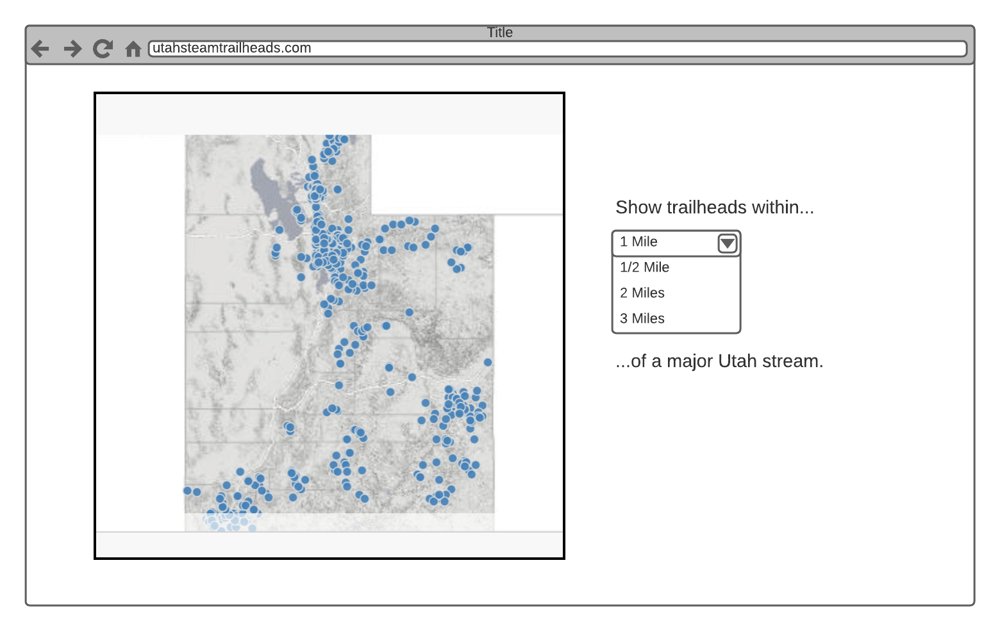

# Mapping Performance Demo

## Overview
This is a repository of several versions of the same "Utah Stream Trailheads" app with varying degrees of performance. The app displays all the trailheads on a map of Utah within a given distance of a major Utah stream/river.

The app versions are found in [app-versions](./app-versions) and listed in increasing order of performance. In each app version folder, you will find a `README.md` file that lists more details about each version.

While there are many geo-specific optimization techniques you would want to use in production or in a larger application, I chose to focus on improvements that can be made to almost any web application.

## App Versions
1. [No Database](./app-versions/1-no-db) - In this one the geoprocessing happens in-memory in a Node.js proccess with the help of [Turf.js](https://turfjs.org/). Given how long the geoprocessing takes, this version isn't really usable.
1. [PostGreSQL](./app-versions/2-postgres) - Here we've loaded our datasets into a production-grade database with a [geoprocessing extension](https://postgis.net/). The queries now take somewhere on the order of four seconds.
1. [PostGreSQL with an Index](./app-versions/3-postgres-indexed) - The only difference between this one and previous is the addition of an index. In our case, it's a [spatial index](https://postgis.net/workshops/postgis-intro/indexing.html#how-spatial-indexes-work), but the principle of indexing applies to any database-backed application. Our index makes the queries orders of magnitude faster. So fast, that we'll need to use a benchmarking tool to measure them.
1. Embedded Database (TODO) - Our datasets are reasonably small and and our app doesn't require user management and authentication. So, we can safely get rid of the overhead of a full database system and instead use an embedded database (still with geospatial capabilities).
1. Static Assets (TODO) - Because our application offers a finite set of discrete distance settings, we can have a background thread do the geoprocessing for each distance and cache the each result as a static geojson file. When we serve these up behind Nginx, a production-grade webserver, this version extremely fast and bullet-proof. We have exploited the nature of our application to decouple the heavy lifting (geoprocessing and database queries) from our network requests.

## Credits
Datasets fetched from Utah SGID, specifically [major streams](https://opendata.gis.utah.gov/datasets/utah-major-streams-statewide) and [trailheads](https://opendata.gis.utah.gov/datasets/utah-trailheads).